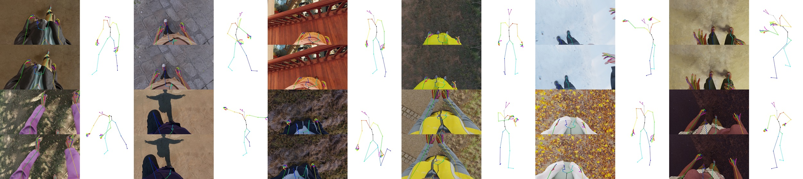

# The SynthEgo dataset

It was introduced in our paper [**SimpleEgo: Predicting probabilistic body pose from egocentric cameras**](https://microsoft.github.io/SimpleEgo/).

Our dataset contains:
- TODO


## Downloading the dataset

TODO

## Dataset layout

TODO

## Generalization to real data

For best results, we suggest you follow the methodology described in our [paper](TODO) (citation below). Especially note the need for 1) data augmentation; 2) use of a translation layer if evaluating on real data benchmarks that contain different types of annotations.

Our dataset strives to be as diverse as possible and generalizes to real test data as described in the paper. However, you may encounter situations that it does not cover and/or where generalization is less successful. We recommend that machine learning practitioners always test models on real data that is representative of the target deployment scenario.


## Citation

If you use the SynthEgo Dataset your research, please cite the following [paper](TODO):


```
TODO
```
